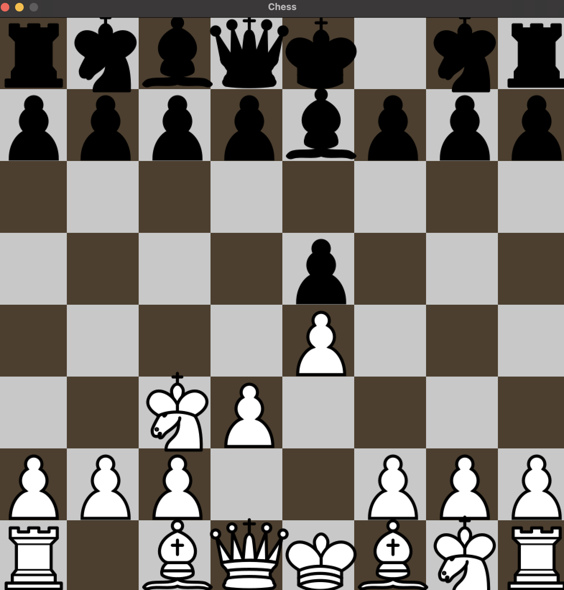
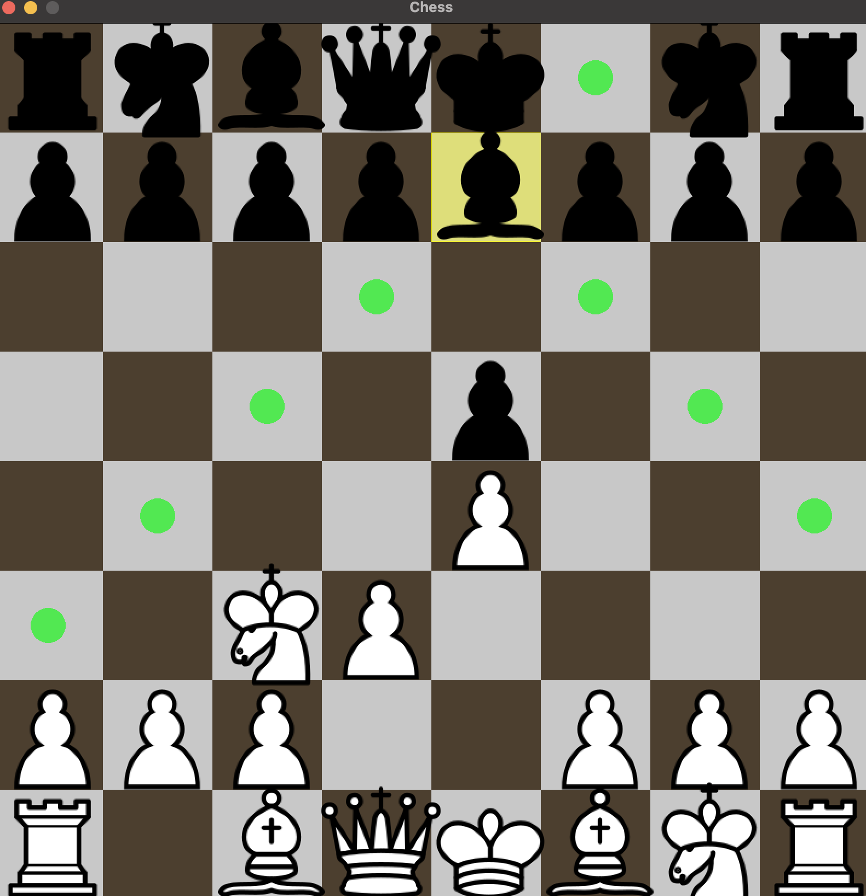

# Chess Game



A complete chess implementation with standard rules and visual feedback, built with C++ and Raylib.

## Features

### Core Gameplay
- ♟️ **All standard chess pieces** with proper movement rules:
  - Pawns (with en passant)
  - Knights (L-shaped movement)
  - Bishops (diagonal movement)
  - Rooks (straight movement)
  - Queen (combination of bishop and rook)
  - King (with castling)


### Visual Feedback
- 🟡 **Selected piece highlighting** (yellow overlay)
- 💚 **Possible moves indicator** (green dots)
- 📜 **Algebraic notation** display for moves
- ♟️ **Piece capture** animations



### Game Mechanics
- ⚪⚫ **Turn-based** gameplay (white/black alternating)
- 🏁 **Check/checkmate** detection
- ♻️ **Game reset** functionality
- 📊 **Move history** in console

### Technical Implementation
- 🏗️ **Object-oriented design** with proper inheritance:
  - Base `Piece` class
  - Derived classes for each piece type
- 🗺️ **8x8 grid system** with cell states
- 🖱️ **Mouse-based** interaction


## Installation

### Requirements
- C++ compiler (g++/clang++)
- Raylib library
- Make

### Build Instructions
```bash
brew install raylib
git clone https://github.com/tadeyemo32/Chess-Engine.git
cd chess-game
make
./build/main